# Team 10 - Java Multiplayer Game

## Notable Changes After Project Completion

When saying "changes" what i mean is that i rewrote most of the project logic and structure. What has remained mostly the same though is the feel, look and tone of the original project. More specifically this version of the project is:

- Singleplayer experience against bots.
    - Server and Database was removed
    - Bots have a simple playstyle and will randomly reply to/send chat messages.
- Fixed issue we had with lag/stuttering during gameplay.
    - Re-added music and sound effects that was removed to remedy this lag issue.
- Stripped down some functionality to simplify code structure and logic.
    - Removed possibility to zoom in and out of the map.
        - Enlarged default map size to better fill screen instead.
    - Removed ability to adjust volume with a slider.
        - Assume user will adjust volume with their OS instead.
    - Removed the stats screen
        - No game data is currently being stored, so there isn't any stats to display.
- Added possibility to play with as many players as there is registered parties.
    - Previously there was a hard limit of 2-5 players.
- Added all required libraries to repository

> Project is now also set up to run from VSCode, (previously used IntelliJ). Requires the Java Extension Pack.

## Demo

### Register and Login

### Creating a Game

### Playing the game

#### Making Moves

#### Bots Playing

#### Game Over

## Screenshots

### Register
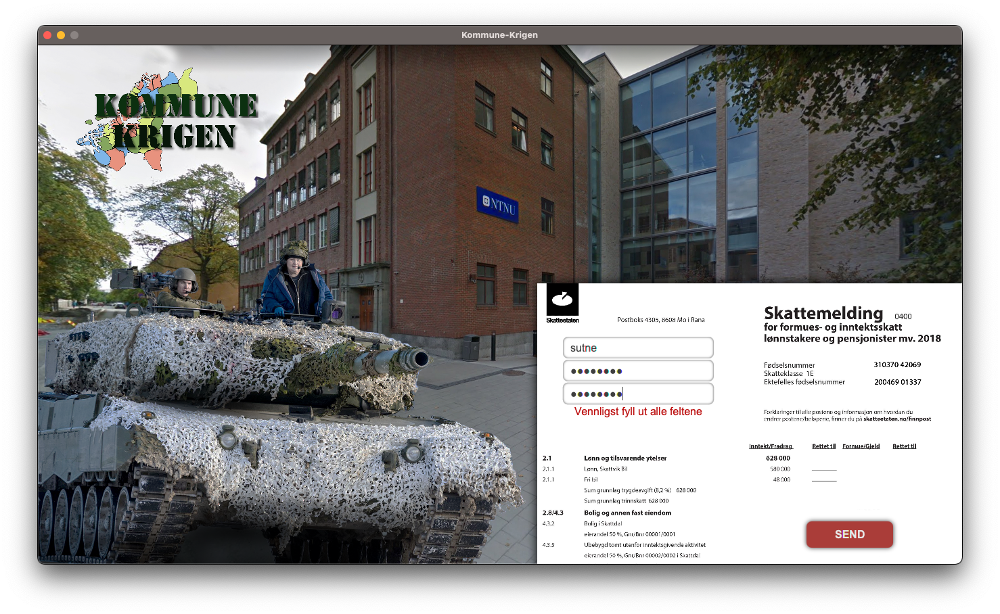

### Login
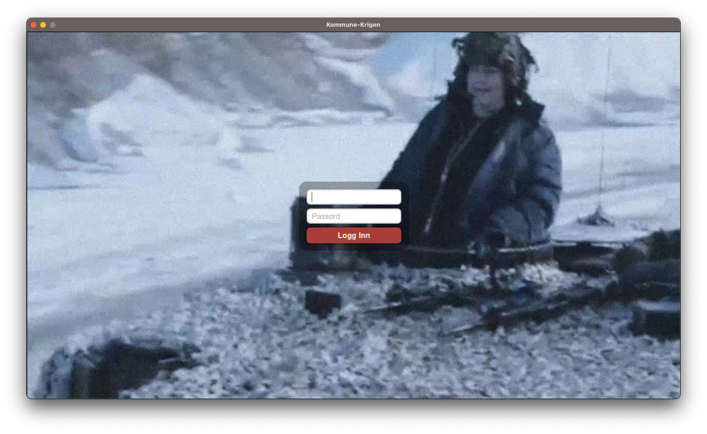

### Menu
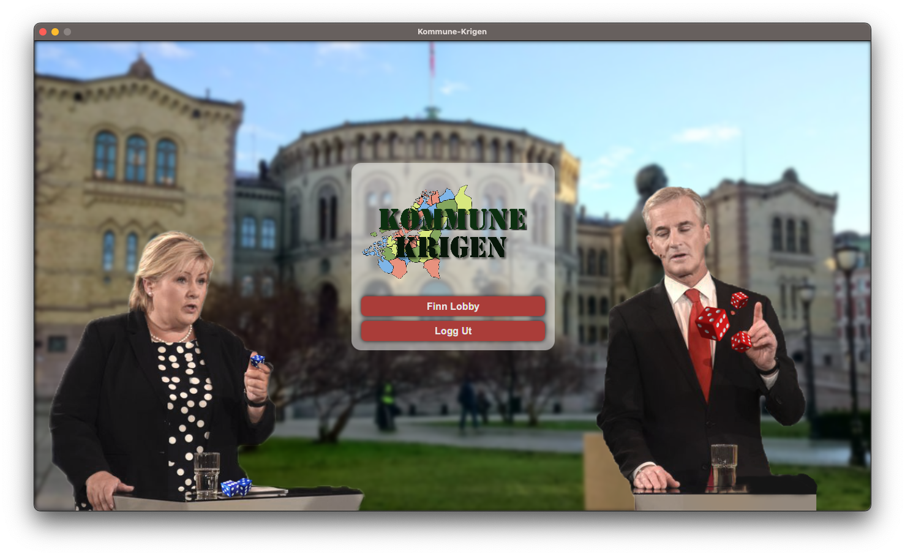

### Lobby
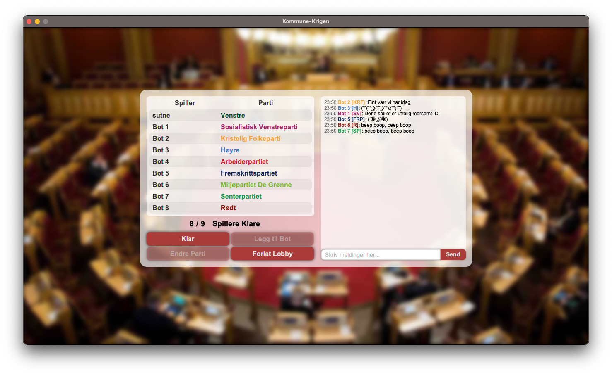

### Game
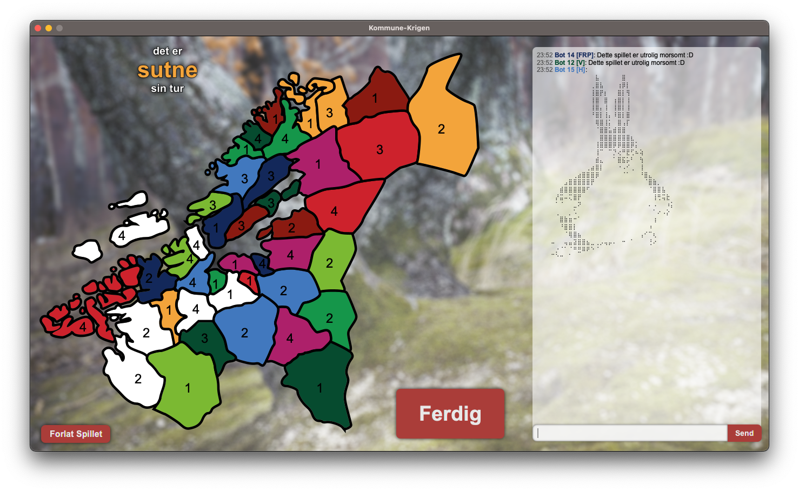
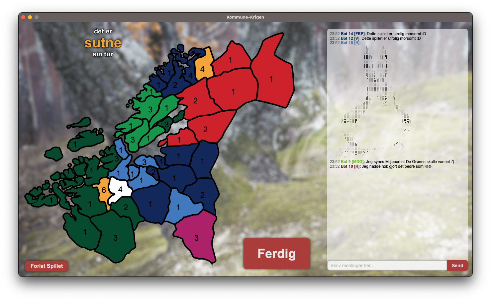
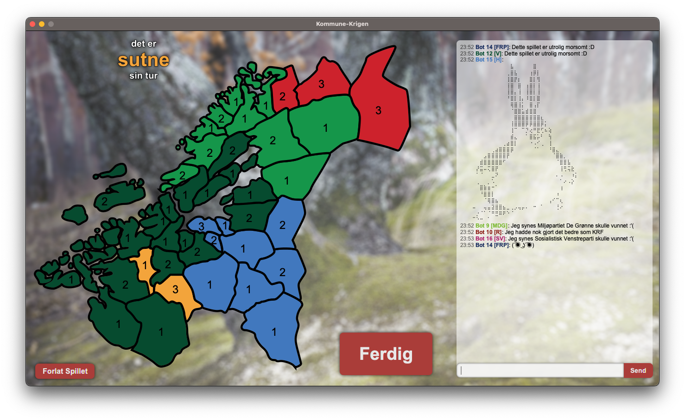
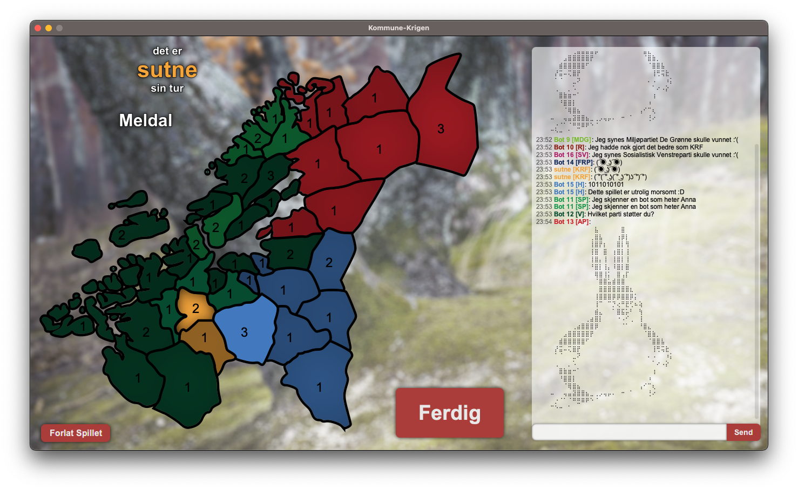
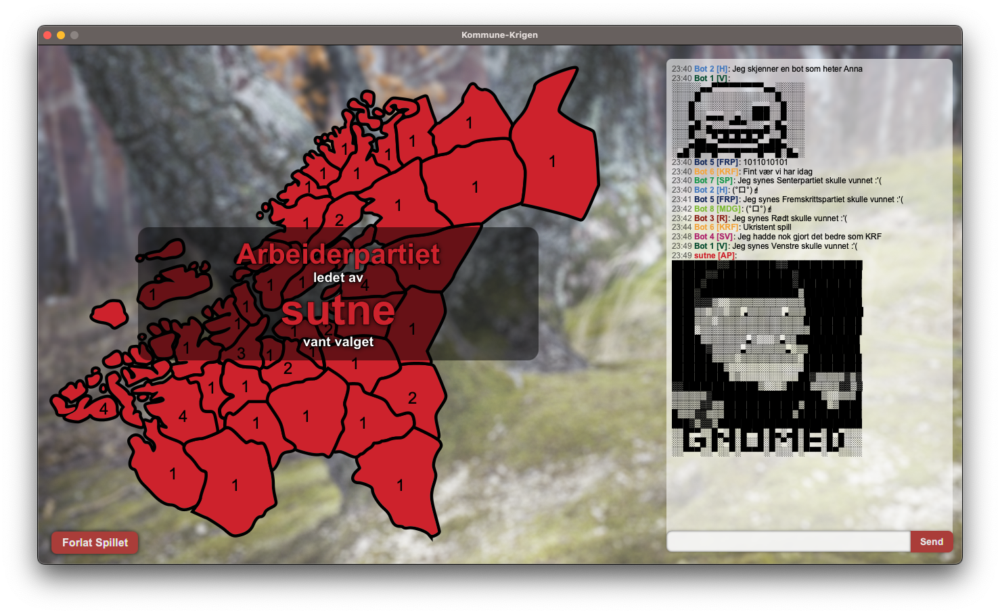

### Test Results
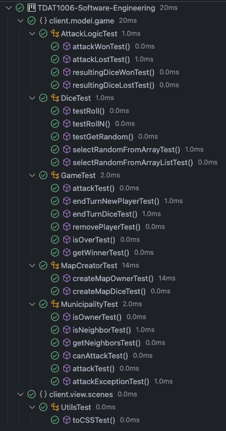

# Original Project

> To see the original project source code, browse [this commit](https://github.com/sutne-NTNU/TDAT1006-Software-Engineering/tree/4eb08fc42da80a4430c227c57fbf772c60b452cd).

Multiplayer game using:

- Java Sockets
- MySQL
- JavaFX

Users had to be able to create and sign into accounts with passwords that had to be stored safely (hashed and salted) in the database.

## Collaborators

- Håkon Gunnarsli
- Sebastian Ikin
- Jan Loennechen
- Birk Stoveland
- Sivert Utne (me)

## Demo

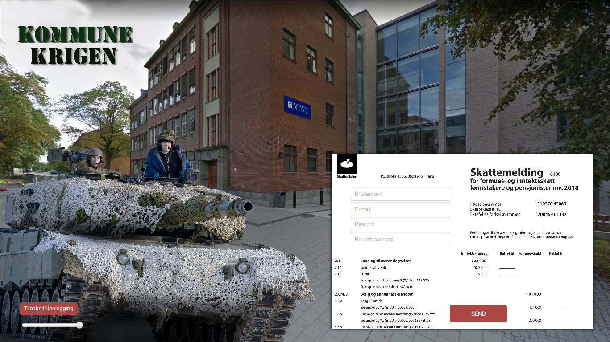

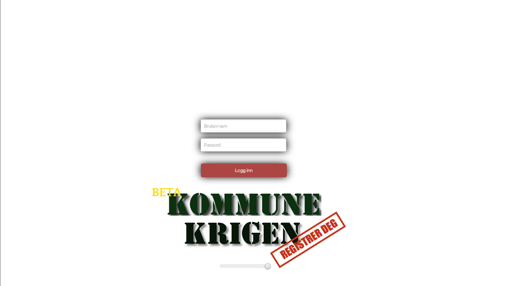

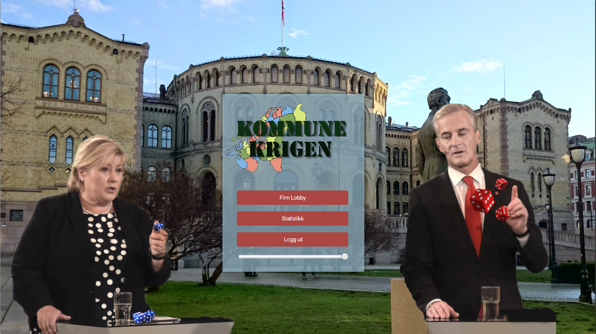

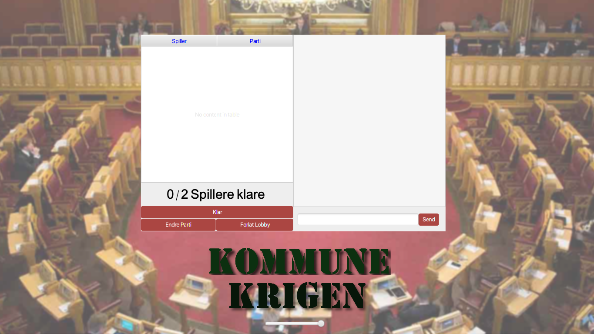

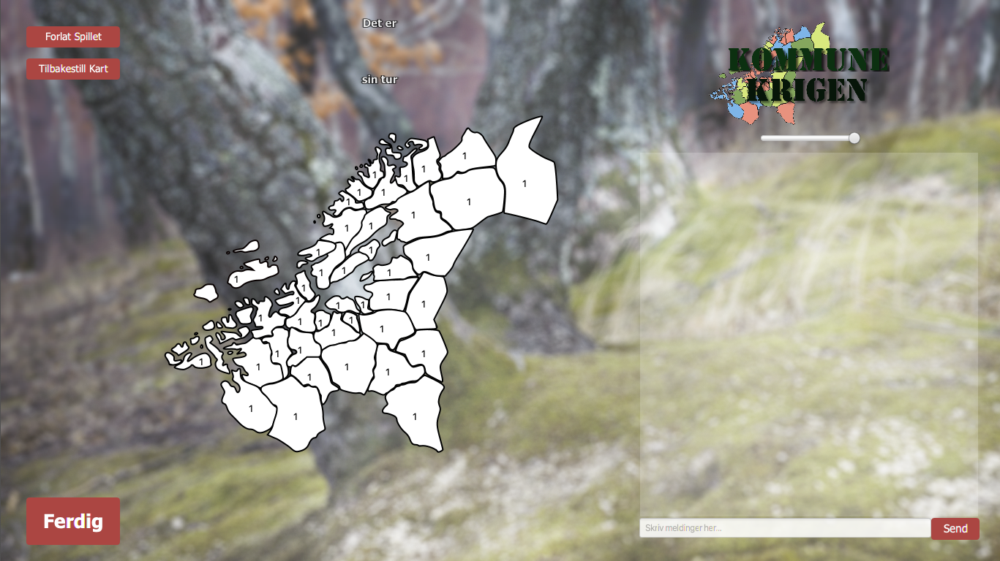

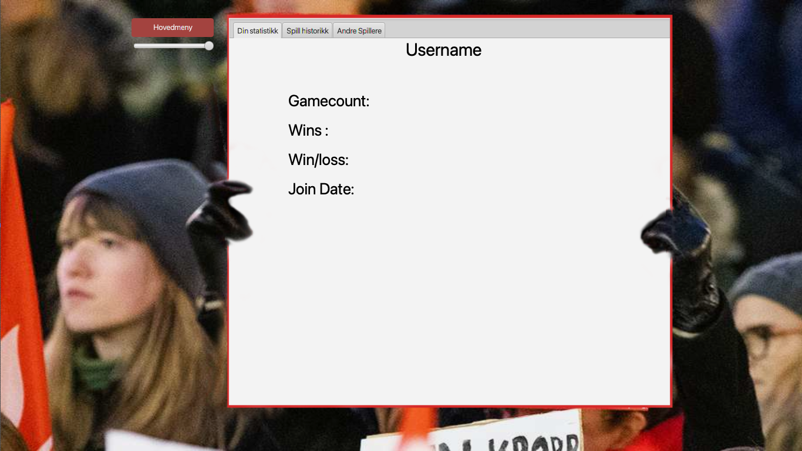

## Game Description

Game is heavily inspired by Risk / Dice Wars.

Basically players fight over control of the map of Norway. More specifically each municipality is its own area, and the players fight over political control over each municipality. To win a municipality a player must 'attack' from a neighboring municipality. An attack takes the number of dice of both municipalities (number of dice represents 'political followers' so more dice = larger politcal influence).

All the dice are rolled, the winner is the player that achieves the highest sum of their dice. If the attacker wins, the attacker gains control of the attacked municipality. After an attack the number of dice remaining in the attacking municipality is always 1. If defender wins, their dice remain the same. If the attacker wins all but 1 dice is moved to (replaces) the defending municipality. After each turn there is a chance that a municipality gains a few additional dice.

A game is won when a single player controls all municipalities.

## Chat

There is also a chat feature where players can trash-talk each other, however the chat has a basic bad-language filter. The players names are coloured according to their political party affiliation, there are also a few emoji strings that can be used to send ASCII art emojis.
